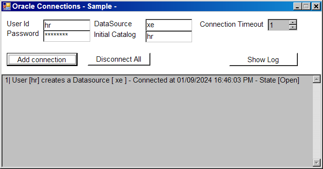
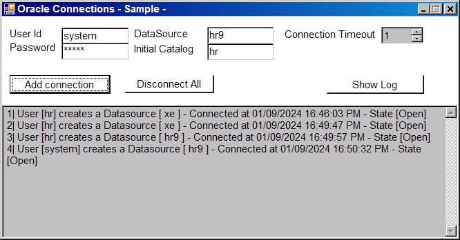
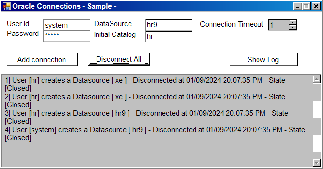

# How to connect an Oracle Data Source by using ADO.NET

<h3>Step 1: Provide a connection string</h3>

To connect to a database, you must provide a connection string to identify the database. The following list describes several common parameters of connection strings.
<ul>
	<li><strong>Persist Security Info:</strong> if is false, the data source does not return security-sensitive if the connection is open.</li>
	<li><strong>User ID and Password:</strong> The data source login and password to use if you are not using integrated security.</li>
	<li><strong>Integrated Security or Trusted_Connection:</strong> if true, the data source uses the current account credentials for authentication, if false, you must specify the User ID and Password in the connection string.</li>
	<li><strong>Data Source:</strong> The name or network address of the data source instance.</li>
	<li><strong>Initial Catalog or Database:</strong> the name of the database.</li>
	<li><strong>Connection Timeout: </strong>The length of time in seconds to wait for a connection to the server before the data source terminates the attempt and returns an error. The default timeout is 15 seconds.</li>
</ul>

<h3>Step 2: Retrieve a connection string from an application configuration file.</h3>

You can either store connection strings in an application configuration file or you can hard-code them directly in your application. If you store connection strings in the configuration file, you can modify them easily, without having to edit the source code and recompile the application. Each connection string that is stored in an application configuration file has its own assigned name. In an application, you can access a connection string by its programmatic name.

<h3>Step 3: Handle connection events</h3>

ADO.NET connection objects have two events that you can use to retrieve informational messages from a data source or to determine if the state of a connection has changed.
<ul>
<li><strong>InfoMessage:</strong> Occurs when a data source returns an informational message. Informational messages are messages from a data source that do not result in an exception being thrown.</li>
<li><strong>StateChange:</strong> Occurs when a connection changes from the closed state to the open state or from the open state to the closed state.</li>
</ul>
If an error occurs at the data source, the data provider throws an exception. However, if the data source returns an informational message, the data provider raises an InfoMessage event instead.

<h3>Step 4: Handle connection exceptions</h3>

The .NET Data provider for Oracle throws an OracleException when it encounters an error or warning generated by an Oracle database. OracleException objects have a Code property that gets the code portion of the error as an integer and message property that gets a description of the error.

The following code show how to test each step in C# code.

<b>Fig 1 Running the sample, asking for a connection string.</b>
 

<b>Fig 2 Enter a connection string and connecting to the database</b>
 

<b>Fig 3 Creating many connections to a different datasources.</b>
 

<b>Fig 4 Showing the exception of a connection </b>
 

<b>Fig 5 Showing the log,this file is written with the <i>InfoMessage</i> and <i>StateChange</i> methods.</b>
 

